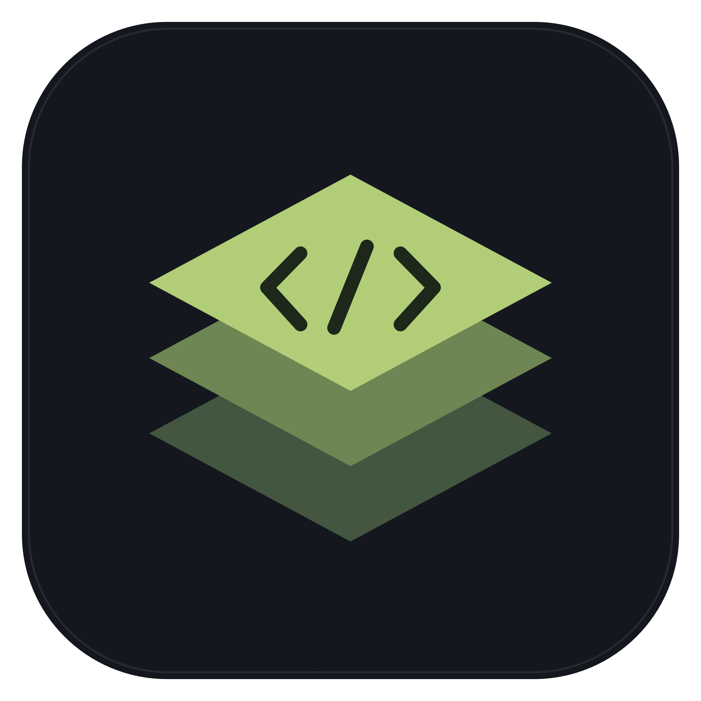
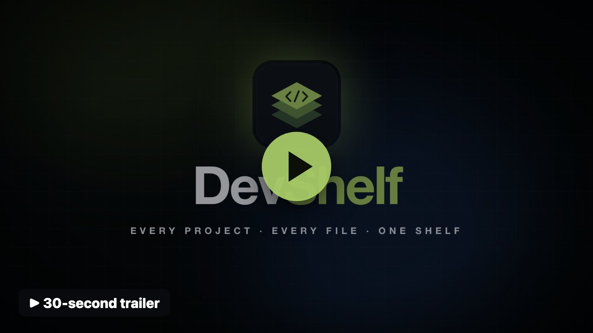
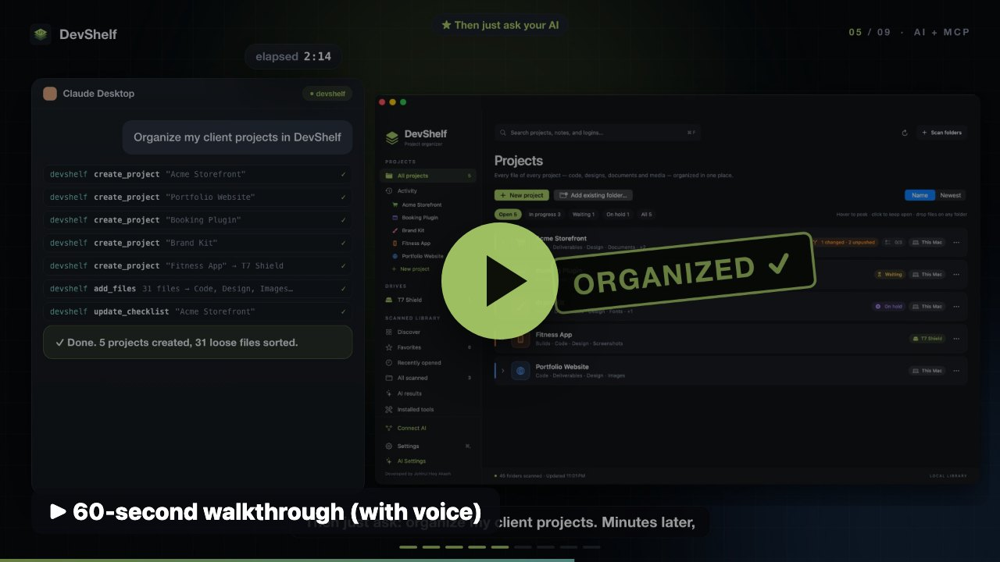

<p align="center"></p>

<h1 align="center">DevShelf</h1>

<p align="center"><b>Every project. Every file. One place.</b><br>
A free, open-source macOS project organizer for developers — with an MCP server so your AI assistant can organize your projects for you.</p>

<p align="center">
  <a href="https://github.com/imjhakash/DevShelf/releases/latest/download/DevShelf-macOS.zip"><b>⬇ Download for macOS</b></a> ·
  <a href="https://github.com/imjhakash/DevShelf/releases/latest">Release notes</a> ·
  <a href="#build-from-source">Build from source</a>
</p>

DevShelf is a native macOS **project organizer**. While you develop a project, it keeps all of that project's files — code, designs, documents, images, videos, fonts, databases, backups — in one central place, so nothing gets lost in Downloads or on the Desktop. Developed by [Johirul Hoq Akash](https://github.com/imjhakash).

## See it in action

| 30-second trailer | 60-second walkthrough (with voice) |
|---|---|
| [](https://github.com/imjhakash/DevShelf/releases/latest/download/DevShelf-trailer-30s.mp4) | [](https://github.com/imjhakash/DevShelf/releases/latest/download/DevShelf-promo-60s.mp4) |

## Why I made this

I'm a developer, and like most developers I work on a lot of projects at once — client sites, plugins, apps, experiments. Over time they ended up everywhere: in Downloads, on the Desktop, in Documents, on old external drives, in folders called `final-v2` and `project-new`. When I needed one specific project I often couldn't find it. I lost a lot of time searching, sometimes opened the wrong copy, and more than once lost the logins and credentials that belonged to a project.

So I built DevShelf for myself. It gives every project one clean, organized home — a folder tree you can actually navigate, the libraries and tools you already have installed, the project's logins (passwords locked in the macOS Keychain), and its Git status — without moving or duplicating your files. Projects can live on an external drive and come back to life the moment you plug it in. And because I spend my day working with AI assistants, DevShelf includes an MCP server: connect Claude Desktop, Claude Code, Codex, Windsurf or Cursor with one click, then just ask *"organize my client projects"* and it's done in minutes.

I'm sharing it as open source in the hope that it saves you the same hours it saves me.

## Download & install

1. Download **[DevShelf-macOS.zip](https://github.com/imjhakash/DevShelf/releases/latest/download/DevShelf-macOS.zip)** from the [latest release](https://github.com/imjhakash/DevShelf/releases/latest). It is a universal app (Apple Silicon and Intel) for **macOS 13 Ventura or newer**.
2. Unzip it and move **DevShelf.app** to your **Applications** folder (the AI connection uses the app's path, so install it there first).
3. Open it. DevShelf is free and not notarized by Apple, so the first time macOS blocks it: open **System Settings → Privacy & Security**, scroll down and click **Open Anyway** (on older macOS you can also right-click the app and choose **Open**). Or run once in Terminal:

   ```sh
   xattr -dr com.apple.quarantine /Applications/DevShelf.app
   ```

To connect your AI assistant, open **Connect AI** in the sidebar — see [AI assistants (MCP)](#ai-assistants-mcp).

## Projects

Each project is a real folder on your Mac or on an external drive.

- **New project** is a small sheet: a name, a colour, an icon, and a **grid of folder types** — Code, Design, Documents, Images, Videos, Audio, Fonts, Brand, Database, Backups, Notes, Research, Screenshots, Builds, Deliverables, Archive. Tap the folders the project needs, add your own, or start from a layout: **Default**, **Empty**, **Web app**, **WordPress**, **Mobile app**, **Design**, **Video & media**, or one of your own templates. The folder is created as `~/DevShelf Projects/<Project name>`.
- **Add existing folder…** puts any folder on the shelf without moving it.
- On the Projects list, **hover** a project to peek at its folders and files, **click** to keep it open, or open the project.
- The project page leads with its **files**: tiles for each file type (Images, Design files, Documents, Code, Videos…) with counts and sizes — click one to list every file of that type wherever it is stored — and a **grid** (Finder-style, with folder-type icons and breadcrumbs) or **tree** view of the folders.
- **Add anything — originals stay where they are:** drop files or folders onto a project, any folder or tile, use **Add files**, or select items in Finder and choose **Services → Add to DevShelf Project**. By default DevShelf **links** them: the file or folder you chose is never moved and never copied — it stays in its original place and appears inside the project as a link (a symbolic link, which Finder, code editors and the Terminal all follow). Links use no disk space and always show the original's latest contents. Linked items show a 🔗 badge; right-click for **Show original in Finder**, **Remove link (original stays)**, or **Relink…** if the original was moved. Hold **Option** while dropping to copy, or **Command** to move, or change the default in Settings → Files. Dragging items that are already stored in the project between its folders reorganizes them. Drive transfers and zips include the real contents of linked items, so they are complete on their own.
- **Find duplicates:** **Find duplicates** (on the Projects list, in a project's ⋯ menu, or in Settings) finds identical files of 256 KB and larger across your projects — optionally also leftover copies in Downloads, Desktop and Documents. It shows which copies really use extra disk space and which are APFS clones (copies on the same disk that share storage and use no extra space, even though Finder shows their full size), pre-selects the extra copies, and moves them to the Trash. One copy of every file is always kept.
- **Scanned folders:** **Add scanned folders…** links code folders DevShelf found on your Mac into a project (or moves or copies them if you choose). You can also drag a scanned project onto a project in the sidebar. Copies skip rebuildable folders such as `node_modules`, `.next`, `.venv` and caches.
- Right-click files and folders for New folder, Rename, Copy path, Show in Finder, Zip & share and Move to Trash.

- **Pin, favourite and colour folders:** right-click any folder inside a project (in the tree, the grid or the Pinned strip) and choose **Pin to top**, **Add to Favorite folders** or **Folder colour**. Pinned folders sort first and appear in a **Pinned** strip at the top of the project page. Favorite folders appear in the sidebar across all projects — click one to jump straight into it, or drop files on it to add them there. Folder colours show in the tree, grid, Pinned strip and sidebar. Marks are saved with the project (and its `.devshelf.json`), and follow a folder when it is renamed or moved.

- **Always up to date:** DevShelf watches every project folder with macOS file-system events. Files you add, save, rename or delete from anywhere — Finder, your code editor, the Terminal, a download — appear in the tree, grid, file-type tiles, Pinned folders, Activity and Git status within about a second, with no manual refresh. Changes inside `node_modules`, `.git` and caches are ignored. Copies on external drives still update only when you choose **Sync now** or **Transfer to drive**.

Each project also has a **status** (In progress, Waiting, On hold, Done) with filters on the Projects list, a **checklist**, and optional **notes** (in **Edit**).

### Developer tools

- **Logins:** save hosting, WordPress, FTP, database or admin logins. Labels, usernames and addresses are saved with the project; **passwords are stored only in the macOS Keychain on this Mac** and are never written to the folder, drive copies or zips. Copied passwords are hidden from clipboard managers and cleared after 60 seconds.
- **Git:** every Git repository inside a project shows its branch, uncommitted changes, commits not pushed, commits behind, and repositories with no remote. Project rows show an orange warning when something isn't committed or pushed.
- **Activity:** files added or changed across all projects in the last day, 7 days or 30 days.
- **Zip & share:** zip a whole project or any folder in it (for example **Deliverables**). By default it leaves out `node_modules` and caches, `.git`, `.env` files and DevShelf's own notes; then share via AirDrop, Mail or Messages.
- **Templates:** a template is a folder layout. Turn any project's layout into one from its **⋯** menu → **Save as template…**.

The project's name, colour, icon, status, notes, checklist and login names are also saved in a hidden `.devshelf.json` inside its folder, so they travel with every copy. Adding a copied folder on another Mac restores them.

> Version 3.0 is a project organizer: client names, deadlines, budgets, custom details and time tracking were removed. Projects saved by 2.x load automatically; a former client name becomes part of the project name (matching its folder name, e.g. "Lawclaro - Website").

### External drives

**Transfer to drive…** copies a project and everything in it (including hidden files such as `.env` and `.git`) to `<Drive>/DevShelf Projects/`. Choose **Copy** to keep it on this Mac too, or **Move** to keep it only on the drive (the Mac folder goes to the Trash). Transferring again — or **Sync now** — copies only new and changed files and never deletes anything on the drive.

Drives are recognised by their volume ID, so a drive is found again even if it mounts under a different name. While a drive is plugged in, its projects and copies appear in colour; when it's removed they turn grey and come back as soon as you reconnect it. Each drive also appears under **Drives** in the sidebar.

The shelf index is saved in `~/Library/Application Support/DevShelf/shelf.json`. Removing a project from DevShelf never deletes its folder.

## AI assistants (MCP)

DevShelf includes a [Model Context Protocol](https://modelcontextprotocol.io) server, so AI assistants can organize your projects when you ask them to — for example: *"Create a project called Portfolio with Code, Design and Images folders, copy ~/Downloads/brand into Design and sort the loose files into the right folders."*

Open **Connect AI** in the sidebar (or Settings → Library & AI) and click **Connect** next to **Claude Desktop**, **Claude Code**, **Codex**, **Windsurf** or **Cursor**. DevShelf adds itself to that app's MCP settings (keeping a one-time backup named `<file>.before-devshelf`); then restart the app. Claude Code is connected with its own `claude mcp add --scope user` command. **Copy setup for other apps** copies a standard `mcpServers` JSON entry for any other MCP client, and **Test server** checks that it answers.

Assistants can list and create projects, create folders, add files from anywhere on your Mac (linked by default: originals stay in place, nothing is copied or moved), find duplicate files, sort files within a project, find files by name or type, rename items, move items to the Trash, update checklists, status, names and colours, pin, favourite or colour folders, bring in scanned code folders, list drives and sync projects to them, zip folders and check Git status. They can only change things inside your projects (files you add can come from anywhere), nothing is deleted permanently, and login passwords are never available to them. While DevShelf is open, their changes appear immediately and the status bar shows what was done; **Recent assistant actions** lists the latest ones.

Assistants start DevShelf from the path it had when you connected, so put DevShelf in Applications first (or press **Reconnect** after moving it). The server runs as `DevShelf.app/Contents/MacOS/DevShelf --mcp` and speaks JSON-RPC over standard input and output.

## Settings

Open **Settings** (⌘, or the sidebar) to change where new projects are created, choose the folders ticked by default in new projects, manage templates, choose your code editor (VS Code, Cursor, Windsurf, Zed, Sublime Text, WebStorm, PhpStorm or Xcode), set the hover-peek speed or turn it off, show hidden files, skip or keep `node_modules` when copying code, and pick the default sort. Settings are saved in `preferences.json`.

## Scanned library

The **Scanned library** section keeps DevShelf's original features: it scans your Mac for development projects and sorts them into nine purpose categories (Discover), with Favorites, Recently opened, All scanned, AI results and Installed tools. Use **Add to a project** in a scanned project's details to copy it into a project, or make it a project of its own.

Local rules provide initial purpose suggestions. In project details, use the Purpose picker to correct a category; manual choices are preserved during future AI runs.

> Version 2.0 replaced the old **My groups** system with Projects. Earlier group data in `groups.json` is left untouched on disk but no longer used.

## OpenRouter key setup

1. Open **AI Settings** in the sidebar or DevShelf menu.
2. Paste your OpenRouter API key into the secure field and click **Save key**. The key is stored in macOS Keychain, never in settings JSON, source code, or inventory exports.
3. The default model is `typesafe/jev-1.13`. You can enter another Jev model ID if available through your OpenRouter account.
4. Review the metadata preview and click **Send metadata & organize**.

The app sends allowlisted scanned-project names, package names, descriptions, frameworks, dependency names, and two classification hints to OpenRouter/TypeSafe. Projects on your shelf are never sent. It does not send source files, scripts, full paths, environment files, or your API key as project metadata. Names and descriptions can contain private information, so the preview is available before sending.

Requests use OpenRouter credits. Classification runs in batches of at most 4, shows progress and provider-reported cost, and can be stopped. Use **Test on 3 projects** for a small trial run. Completed batches are saved. There are no background classification requests and no automatic retries. New or changed projects and uncertain results can be classified again; unchanged confident results are skipped unless you choose reclassification. AI labels are invalidated when the underlying metadata changes; manual labels remain in effect.

Jev's Decisions API returns category choices and confidence. Results below 70% confidence remain suggestions in **AI results** and Needs review. Accepting a suggestion saves a manual choice; the original AI result remains available after acceptance and app restarts. Classification opens the results screen immediately, shows progress as batches are saved, and displays failures there. The app checks only key presence during startup, so Keychain permission dialogs do not block the dashboard; the key is read only when classification begins. Invalid or incomplete responses leave that batch unchanged. Local rules remain available if authentication, credit, network, or provider errors occur.

The integration follows [Jev's Decisions API documentation](https://openrouter.ai/docs/api/api-reference/alphadecisions/submit-a-decisions-request). Live classification requires your saved key and credits; it cannot be verified with fixture tests alone.

## Open

Launch `DevShelf.app` from your Applications folder or Spotlight. The app rescans when opened, and shows the previous inventory immediately while scanning. Press **⌘R** to refresh after adding or moving projects. Press **⌘F** to search.

The initial scan covers your whole home folder, including nested projects and Codex worktrees. macOS may ask for access to Documents, Desktop, or Downloads; allowing access lets those folders appear in your library. Open **Scan folders** to change the roots or see permission warnings.

## What it finds

- Node projects through `package.json`, with framework icons, dependency lists, requested/installed versions, and scripts.
- WordPress plugins through PHP `Plugin Name` headers; WordPress sites through their core entry files.
- PHP/Composer and Laravel projects, Python projects, static HTML websites, and other Git repositories.
- Global npm packages in common Homebrew, npm, nvm, and custom-prefix locations, with their installed versions.
- Developer executables including Node, npm, Git, PHP, Python, Bun, pnpm, Yarn, Composer, and Docker.

A project's internal HTML folders are grouped under that project. Independent nested projects with their own manifests still appear separately. WordPress sites inside `public_html` use the parent folder's name to make domains easier to recognize.

Click a project card for details. The **Open** button uses VS Code, with Cursor as a fallback. Finder opens the containing location. Terminal opens a shell already in that project's directory; macOS may request Terminal Automation access on first use. Project scripts are displayed for reference.

Use the star to favorite projects. **Recently opened** tracks projects opened through DevShelf. Two copies of a project remain separate cards because each has a different path. Search also matches paths, framework names, and project dependencies.

## Scan scope and local data

The scanner reads metadata and does not move or edit projects. It skips `node_modules`, `vendor`, Git internals, build output, caches, credentials, symlinked directories, app bundles, and `~/Library`. Projects stored inside a skipped location can be added as explicit scan roots. Discovery uses project markers; loose files without these markers do not appear automatically.

Scan warnings show folders that could not be read. The library is a snapshot; **⌘R** updates it. Global package discovery covers common npm layouts rather than every possible custom package manager setup.

Settings, favorites, recently opened paths, and the cached inventory are saved in:

`~/Library/Application Support/DevShelf/`

**Library → Export inventory…** exports a JSON snapshot. The app runs no install or project scripts. Network requests occur only when you explicitly start Jev classification in AI Settings. Purpose assignments are stored separately in `organization.json`, saved AI category results in `jev-results.json`, and your projects in `shelf.json` beside the cached inventory.

## Build from source

Requires Apple's Swift compiler (Xcode Command Line Tools) on an Apple Silicon Mac, macOS 13 or newer:

```sh
./build.sh
/usr/bin/python3 tests/test_scanner.py
/usr/bin/python3 tests/test_mcp.py
open build/DevShelf.app
```

The app is locally ad-hoc signed for use on this Mac. To distribute to other Macs, use an Apple Developer signing identity and notarize the app. For an Intel build, change the target in `build.sh` to `x86_64-apple-macosx13.0`.

The scanner also has a read-only command-line mode:

```sh
build/DevShelf.app/Contents/MacOS/DevShelf --scan-only --root "$HOME/Projects"
```

Repeat `--root` to scan multiple roots. An omitted root scans your home folder.

The [released app](https://github.com/imjhakash/DevShelf/releases/latest) is a universal binary: both architectures are built with the same `swiftc` command (`-target arm64-apple-macosx13.0` and `-target x86_64-apple-macosx13.0`) and joined with `lipo -create`.

## Contributing

Issues and pull requests are welcome. Please run the checks in [Build from source](#build-from-source) before opening a pull request.

## License

DevShelf is released under the [MIT License](LICENSE). © 2026 Johirul Hoq Akash.
